# FEA Lab 2: Crystal Plasticity

In this lab we will learn how to simulate elastic, isotropic hardening, and crystal plasticity response from a polycrystal of Aluminum 2024 T3.

## Generic steps for an FEA mode
1. Geometry creation.
2. Meshing.
3. Material selection.
4. Selecting Physics.
5. Solver settings and solution.
6. Postprocessing.

In this lab we have already completed the first two steps and the .cdb file you have contained a meshed geometry. Open ANSYS Workbench (I used 2023R2).
## Step:1 Importing External Model in ANSYS Workbench
Locate the External Model and drag it into Project Schematic:

Right-click on Setup > Edit > Location > Browse, and locate the .cdb file provided.

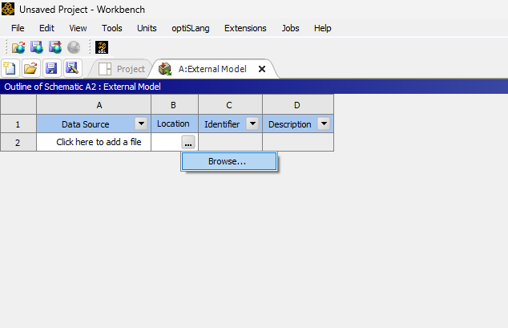

Click on cell 2A and make sure the right set of units are selected.

Click on the project tab to get back to project schematic window.

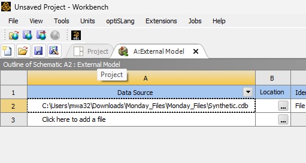

Locate Static Structural model and drag and drop it into project schematic.

Click on Model section from the External Model and drag it to the Model section in Static structural.

Right click on the model tab in external model and update it.

Right click Model section in Static Structural and select properties. In properties tab set object renaming to off.

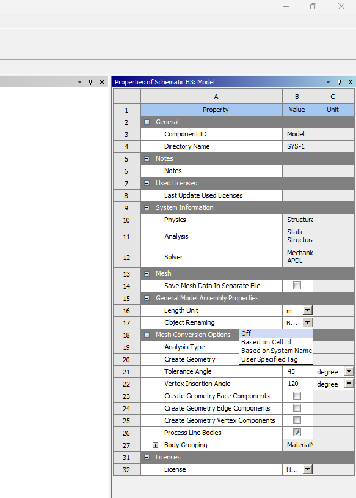

Now Double click on Model in Static structural and open it. You Should see the geometry. If you don't see it, close the current window and update model section in the External Model. 

Make sure you select the same units here as well. As shown below.

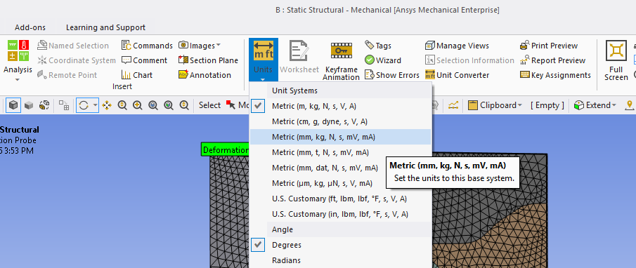

All of the boundary conditions will be applied by right clicking statis structural in the project outline tree and clicking on insert and then selecting displacement as shown below.

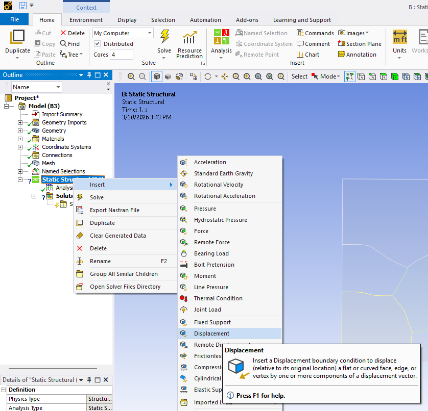

Apply the following boundary conditions. Do not forget to select appropriate facec for the BCs. These set of boundary conditions are there to make sure we stay in plain strain situation (no strain z direction)

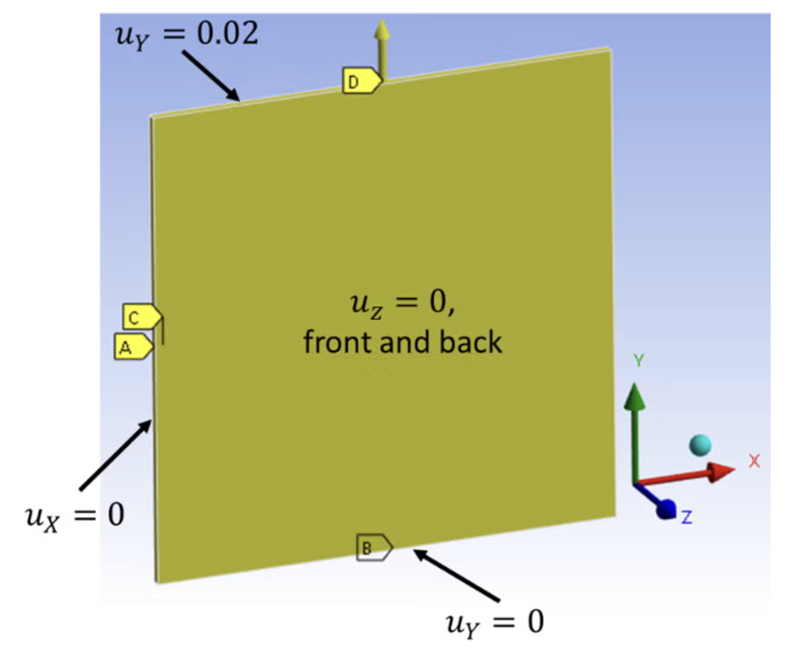

You will end up having 5 displacement boundary conditions. If you see a question mark by any of them that means you have not selected a face to apply that boundary condition on. Once you have all the BCs, we will add a Command snippet as shown below.

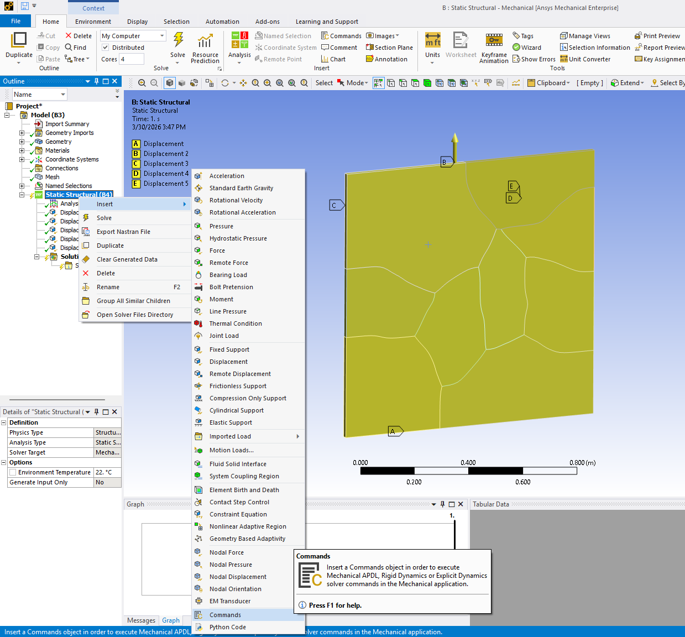

Based on which material model you are running, copy the contents of the .dat file into the command page.

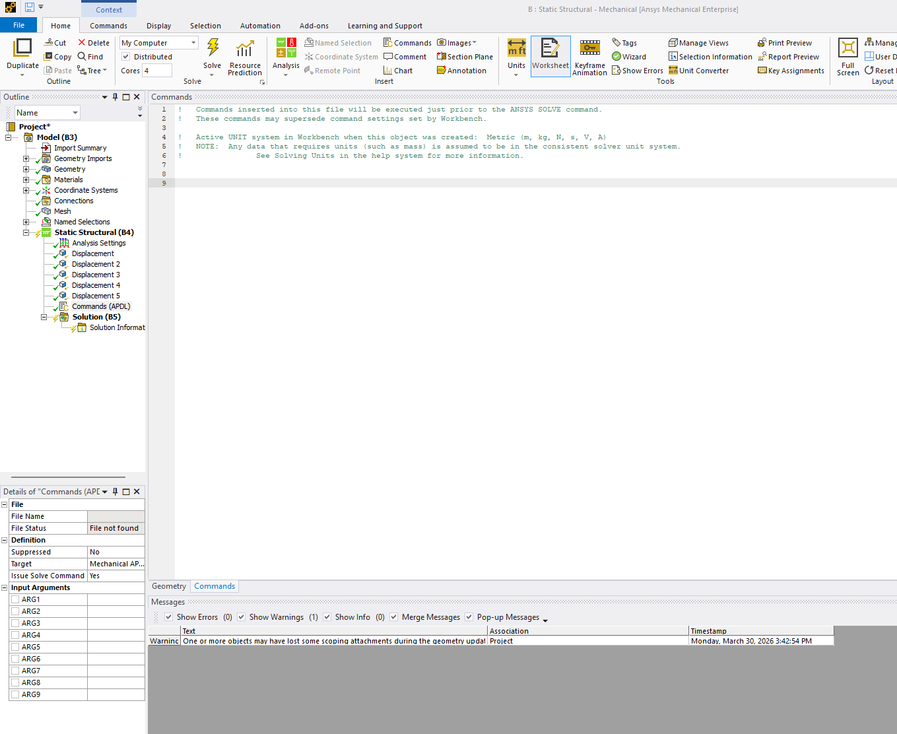

Click on the analysis setting snippet under static structural and go to the details section. Turn the auto time stepping on. Then apply the following settings.

Click on solve as shown below.

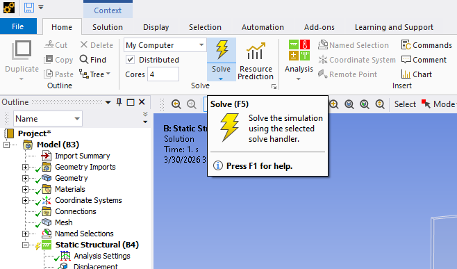

Once the solution is complete. You can add results as shown below.

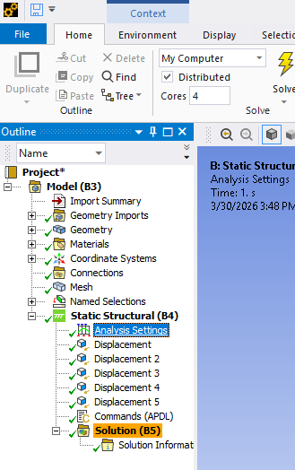

You can add user defined stress and strain results (SY or UY) on the face where you applied the strain. Following figures show the steps.

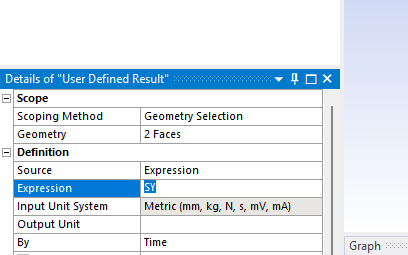

You can export the results in .txt or .csv files as shown below.

For deformation you can either add a user defined results by replacing "SY" expression with "UY" or add a deformation result (and choose Y axis result). You can export this result in the same way as that of stress and plot stress vs strain externally.
Once you have stress and strain CSVs (or txt) fiels you can plot and compare them.
