# Problem 2 – Rectagular plate with a hole

In this problem we will try to understand the role of mesh refinement in getting accurate results.

We will use the following geometry.

## Outline

0. Create the geometry.
1. See effects of mesh size on mesh-represented geometry.
2. See effects of mesh size on average strain energy.
3. Use `Convergence` functionality to automatically get mesh converged results.

## 0. Create the geometry

Open ANSYS Workbench (I used 2023R2). There might be some variations in where the software options are depending on version.

Drag and drop `Static Structural` model inside the project schematic.

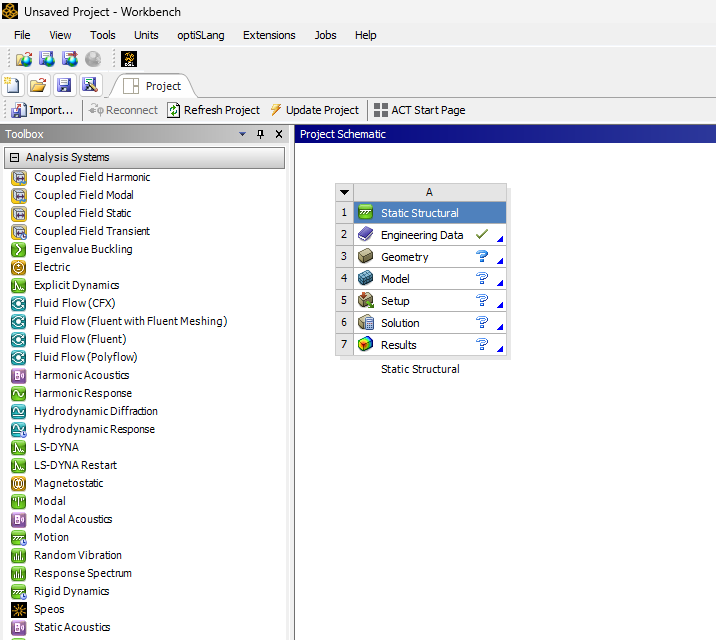

Right click on Geometry and choose `New SpaceClaim Geometry`. There are other options to create geometry: choose any. We will follow `New SpaceClaim Geometry`.

Follow the steps below to create the geometry. I used `Constraints` to center the circle inside the rectangle.

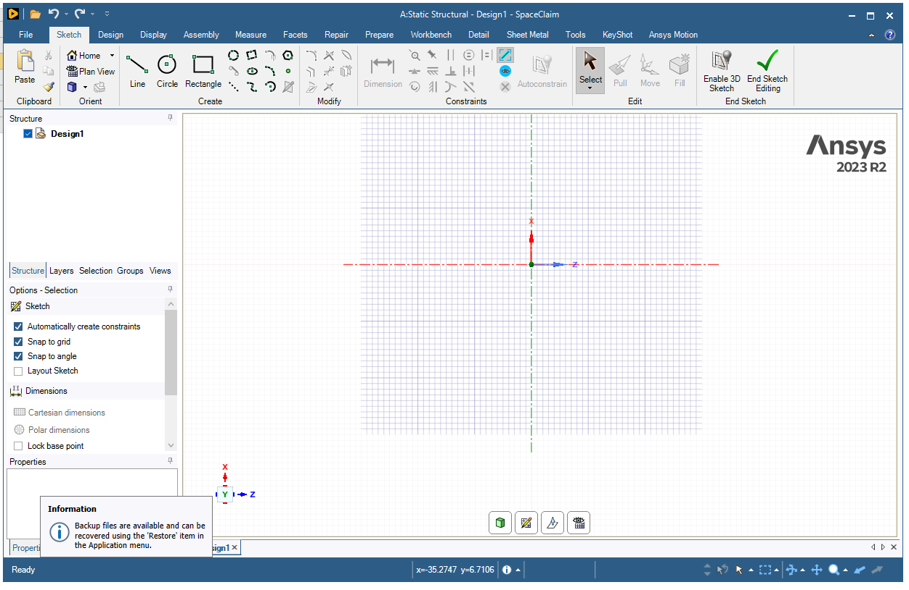

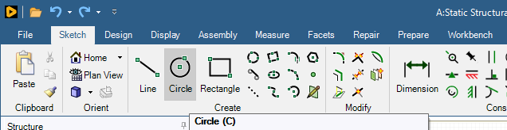

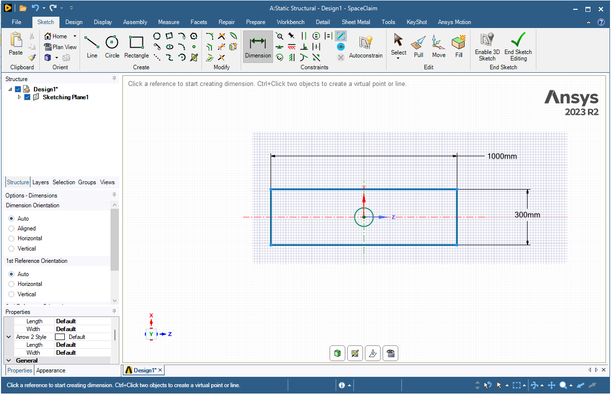

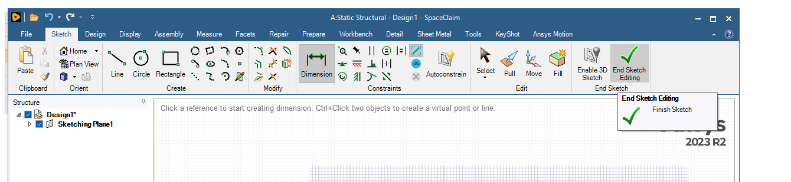

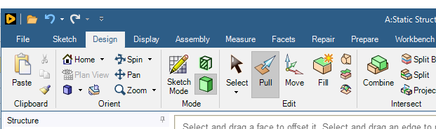

## 1. See effects of mesh size on mesh-represented geometry.

Once you have finshed creating geometry. Minimize the window and get back to `Workbench`. Open `Model`. You should see the geometry.

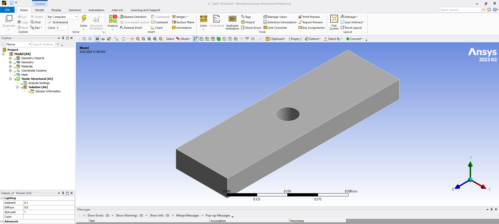

Don't forget to choose the units in mm ..

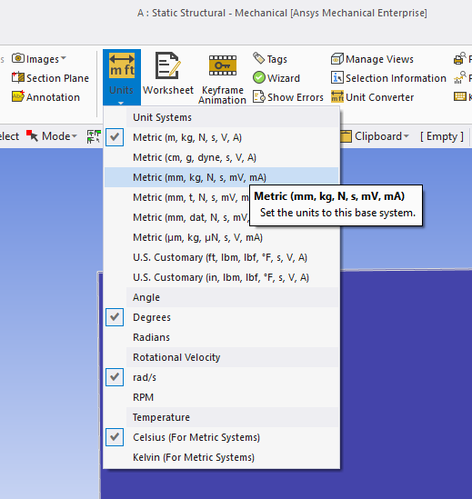

Right click on `Mesh` and `>Insert>Method`

Select the geometry (whole body not a face) and click on apply.

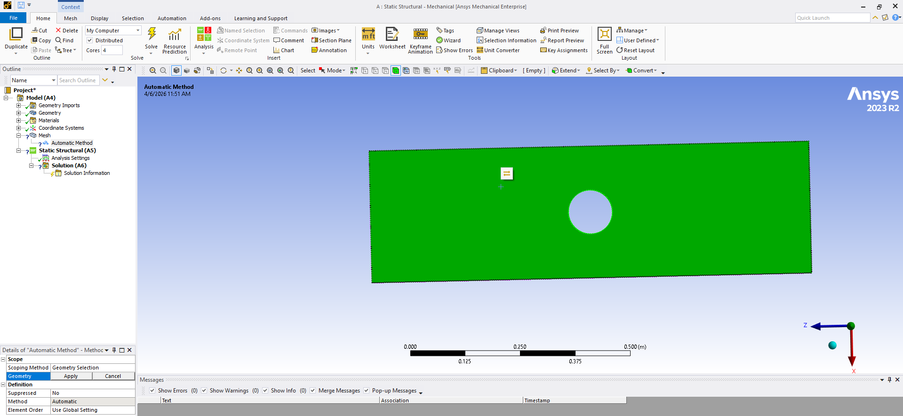

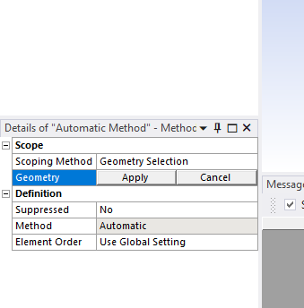

Choose the `Cartesian` method.

Once you have changed the `Method` to Cartesin, right click and `>inset>sizing`

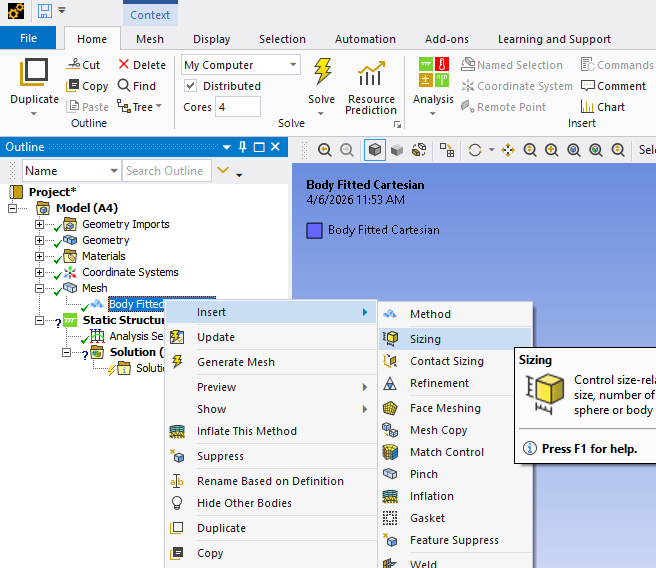

Right click on `Mesh` and generate the mesh. This will generate the default sizing.

If you want to edit the element size, click on the sizing snippet under mesh and in the details input your desired element size and generate the mesh. Generate the mesh for `Element Size: 50, 40, 30, 20, 10` and observe how the circular geometry is represented in each case.

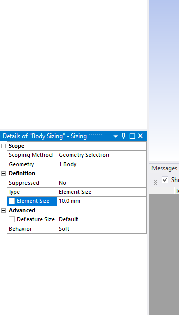

`Delieverable :` Attach images of the geometry at each mesh size and comment on mesh quality.

## 2. See effects of mesh size on average strain energy.

Once you have seen the effect of mesh sizing on mesh-represented geometry, we can move on to its effects on the calculated results.

Right click on `Static Structural` and `>insert>displacement` to add a displacement boundary condition. You wil need two of these boundary conditions to pull on the two opposite sides. For example, in the case below we have two displacements +5 mm and -5 mm on faces `A` and `B` respectively. Make sure you set all other displacemnts to zero ( x and y in this case).

`Delieverable :` A graph of mesh element size and the average strain energy.

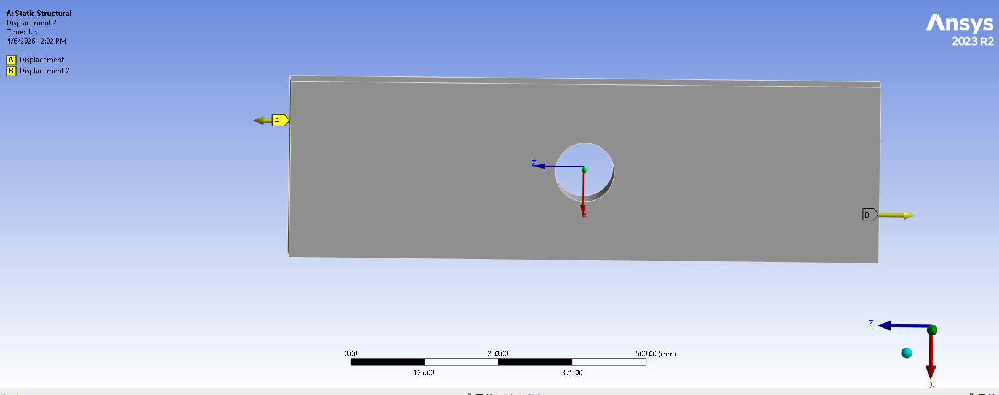

Now you can click the `Solve` button and solve the model. Once solved you can add results (stain energy in this case) by right clicking `Solution` and `>inset>Energy>Strain Energy`. Right click on the Strain energy result and click retieve this result. On bottom right side of the screen you should be able to find a table stating min, max and avg values of the strain energy.

Solve the model and get avg strain energy for each of the `Element Size: 50, 40, 30, 20, 10` case. (Mesh>Sizing)

## 3. Use `Convergence` functionality to automatically get mesh converged results.

Now, lets use the `convergence` functionality available in ANSYS. First, we need to set the method back to automatic. For that, click on `Mesh > Body Fitted Cartesin` and select the `Method` back to `Automatic` as shown below:

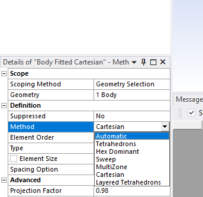

Regenerate the mesh and then right click on `Strain Energy` in results and `>inset > Convergence`.

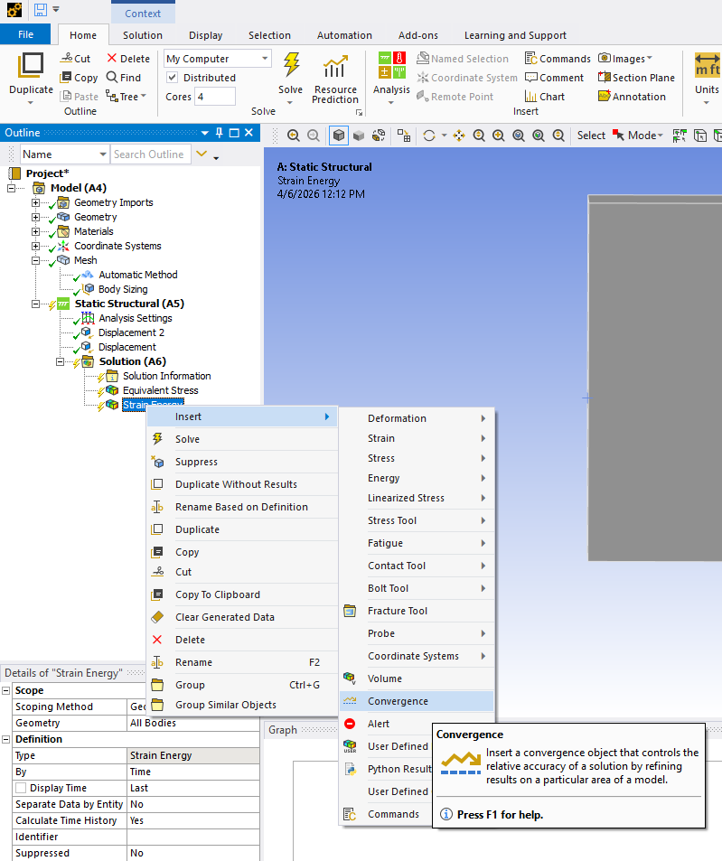

Then click on the `Convergence` snippet and set the `Allowable Change` to 5 percent. Which means that during the mesh refinenet steps once the new results in witin the 5% for old result the mesh refinement will stop.

Then click on `Solution` and set the `Max Refinement Loops` to 10.
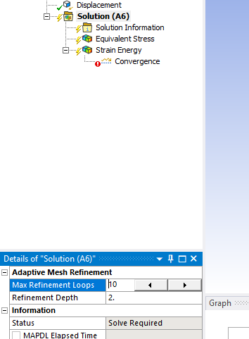

Then click solve.

`Delieverable:` The mesh convergence graph. (click on `Convergence` to get it)
