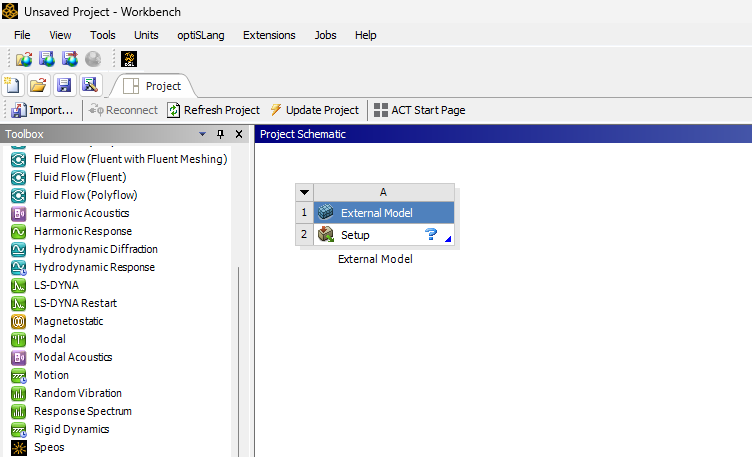
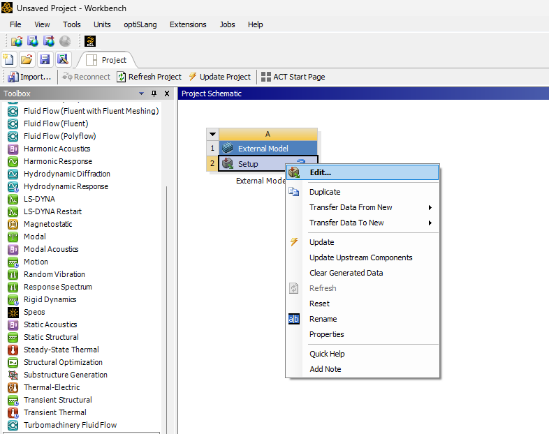
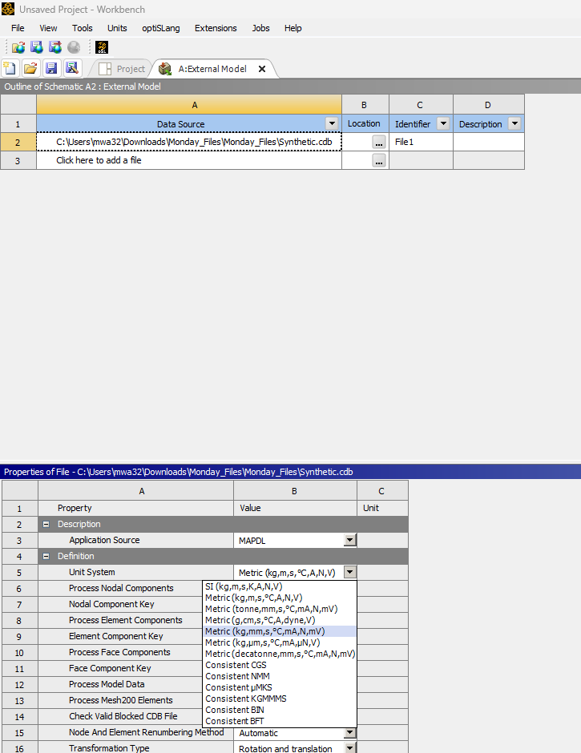
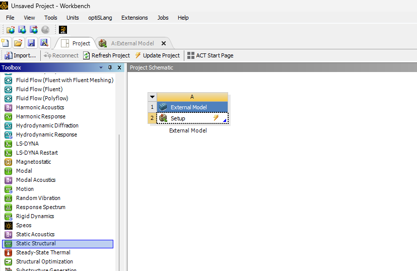
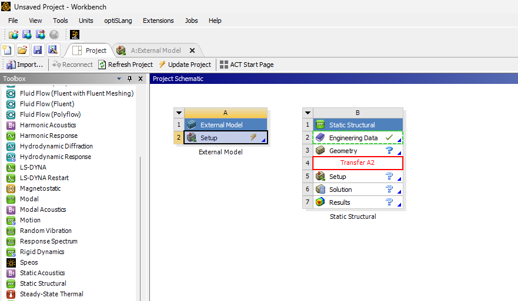
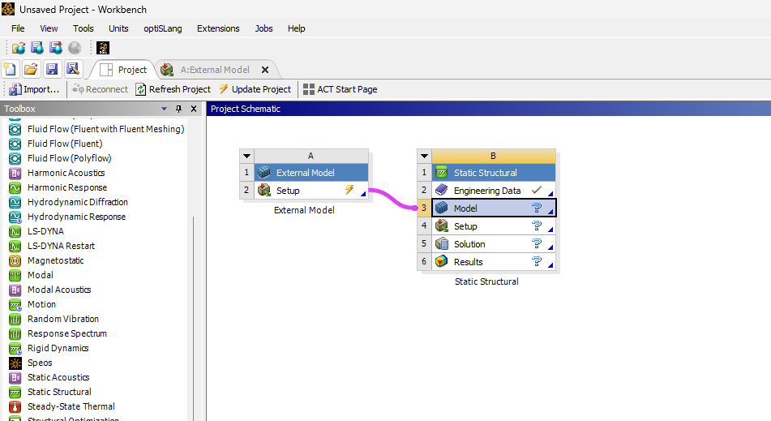
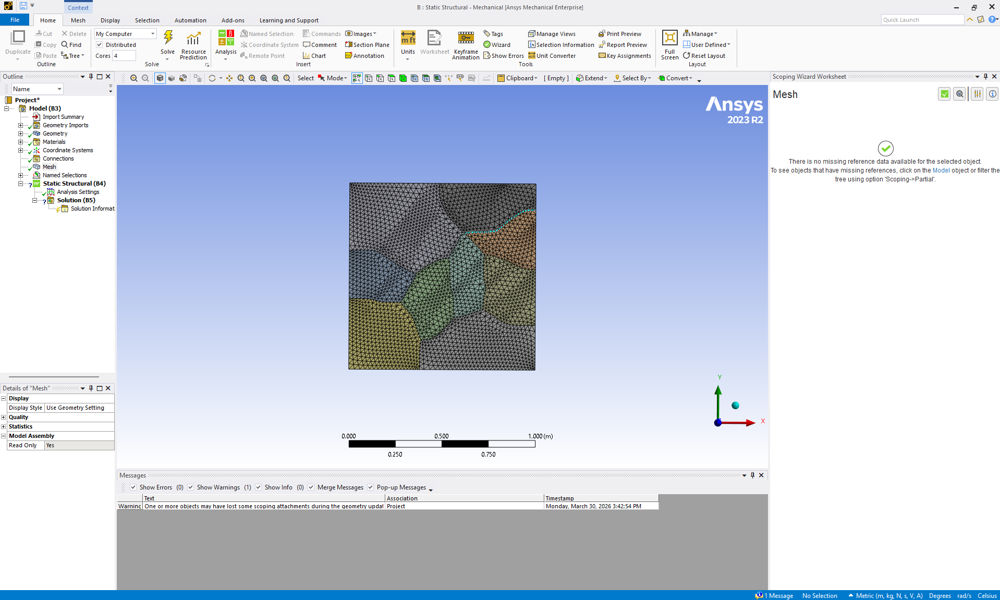
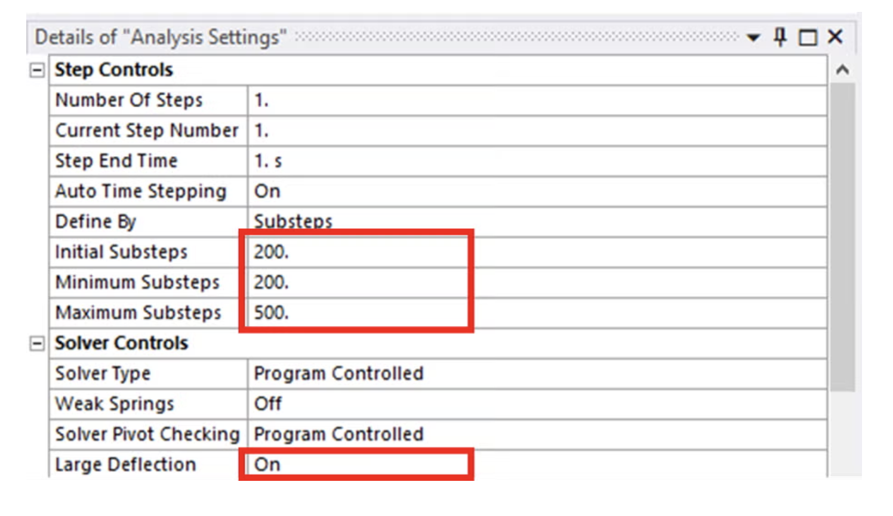
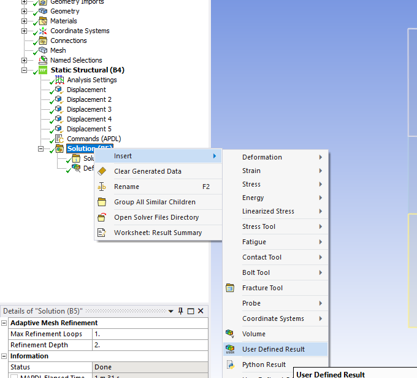
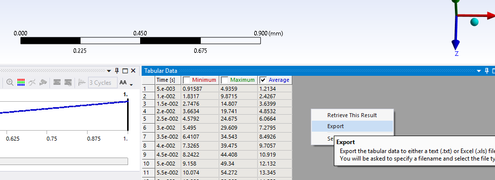

# FEA Lab 2: Crystal Plasticity

In this lab we will learn how to simulate elastic, isotropic hardening, and crystal plasticity response for a polycrystal of Aluminum 2024 T3.

## Generic steps for an FEA mode

1. Geometry creation. (Provided)
2. Meshing. (Already done.)
3. Material model selection. (three .dat files)
4. Solver settings and solution. (Explained below)
5. Postprocessing. (Outside ANSYS)

In this lab we have already completed the first two steps and the .cdb file you have contained a meshed geometry. Open ANSYS Workbench (I used 2023R2). There might be some variations in where the software options are depending on version.

## Importing External Model in ANSYS Workbench

Locate the `External Model` and drag it into `Project Schematic` page:

Right-click on Setup > Edit > Location > Browse, and locate the .cdb file provided.

Click on cell 2A and make sure the right set of units are selected.

Click on the `Project` tab to get back to project schematic window.

Locate `Static Structural` model and drag and drop it into project schematic.

Click on `Setup` section from the `External Model` and drag it to the `Model` section in `Static structural`.

Right click on the `model` tab in `external model` and update it.

Right click `Model` section in `Static Structural` and select `properties`. In properties tab set `object renaming` to off.

Now Double click on `Model` in `Static structural` and open it. You Should see the geometry. If you don't see it, close the current window and update `model` section in the `External Model`.

Make sure you select the same `units` here as well. As shown below.

All of the boundary conditions will be applied by right clicking `statis structural` in the `project outline` tree and clicking on insert and then selecting `displacement` as shown below.

Apply the following boundary conditions. Do not forget to select appropriate facec for the BCs. These set of boundary conditions are there to make sure we stay in plain strain situation (no strain z direction)

You will end up having 5 `displacement` boundary conditions. If you see a question mark by any of them that means you have not selected a face to apply that boundary condition on. Once you have all the BCs, we will add a `Command` snippet as shown below.

The strain on the face (labled `D`) below should be around `0.0027 mm` for `elastic` model (make sure units are correct). For `isotropic hardening` and `crystal plasticity` models keep it as `0.02 mm`

Based on which material model you are running (elastic, isotropic hardening, or crystal plasticity), copy the contents of the .dat file into the command page. You can add multiple `command` snipets (for each material model case) as long as you `suppress` all except the one you want to use (by right clicking it).

Click on the `analysis setting` snippet under `static structural` and go to the details section. Turn the `auto time stepping` on. Then apply the following settings.

Click on `solve` as shown below.

Once the solution is complete. You can add results as shown below.

You can add `user defined results` (`Expression`: SY or UY) on the face where you applied the strain. Following figures show the steps. Here SY is stress in the Y direction, and UY is the displacement in Y direction. Since the length is `1mm` the displacement in mm should be the strain as well.

You can export the results in .txt or .csv files as shown below.

You can export the stress and strain results via `Export` function in their respective tables.
Once you have stress and strain CSVs (or txt) fiels you can plot and compare eash material model case.
