# Problem 2 – Rectagular plate with a hole
In this problem we will try to understand the role of mesh refinement in getting accurate results. 

We will use the following geometry.
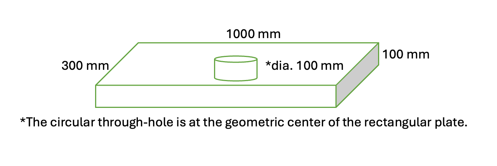
## Follow the following instructions.

Open ANSYS Workbench (I used 2023R2). There might be some variations in where the software options are depending on version.

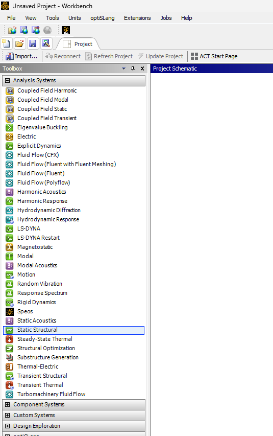

Drag and drop `Static Structural` model inside the project schematic.

Right click on Geometry and choose `New SpaceClaim Geometry`. There are other options to create geometry: choose any. We will follow `New SpaceClaim Geometry`.

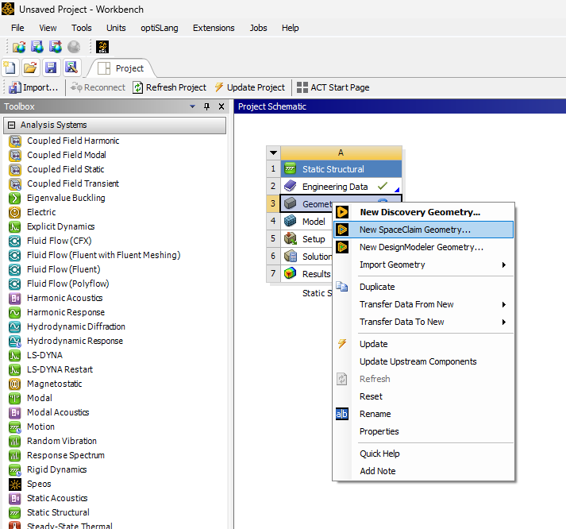

Follow the steps below to create the geometry. I used `Constraints` to center the circle inside the rectangle.

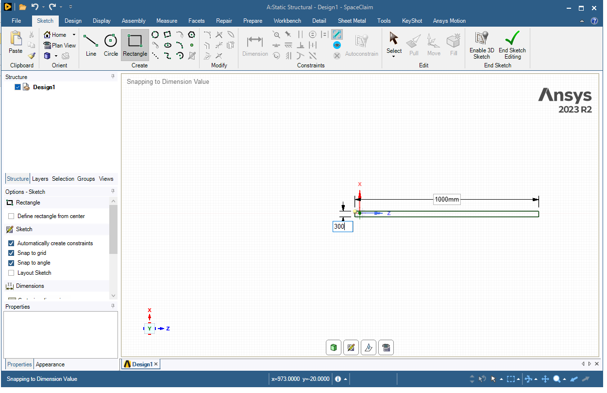

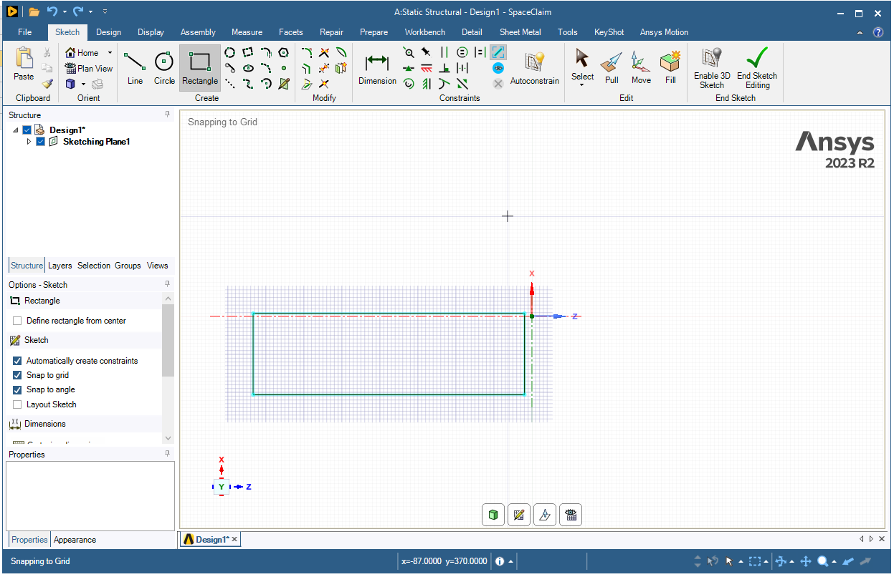

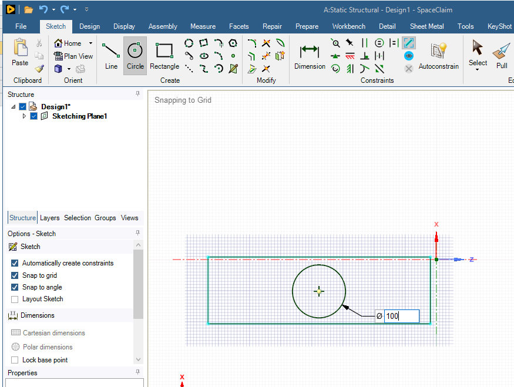

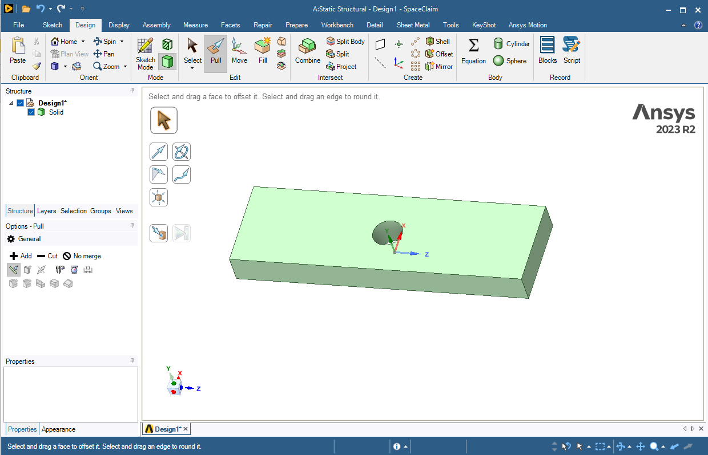

Once you have finshed creating geometry. Minimize the window and get back to `Workbench`. Open `Model`. You should see the geometry. 

Don't forget to choose the units in mm ..

Right click on `Mesh` and `>Insert>Method`

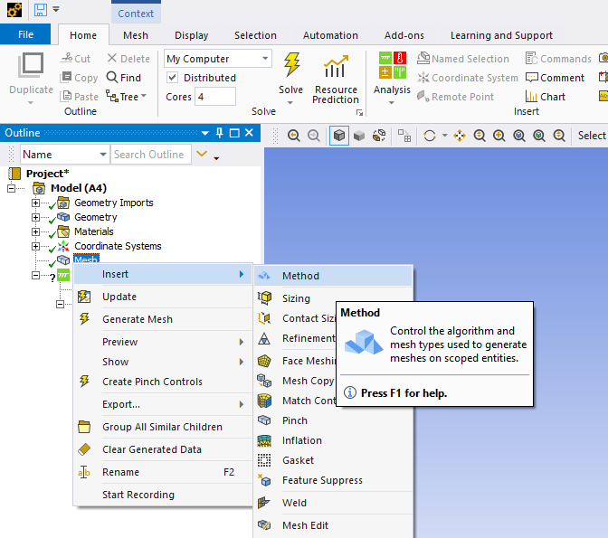

Select the geometry (whole body not a face) and click on apply.

Choose the `Cartesian` method.

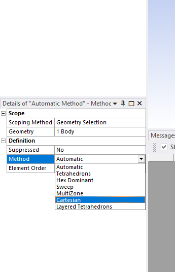

Right click on `Mesh` and generate the mesh.

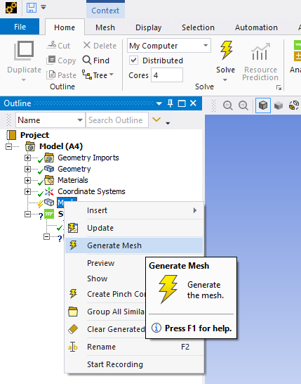

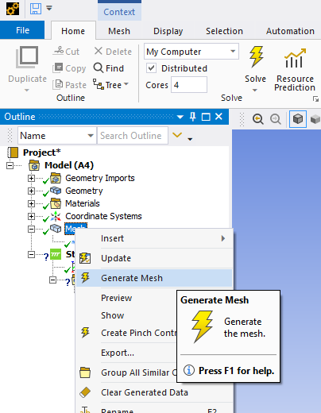

